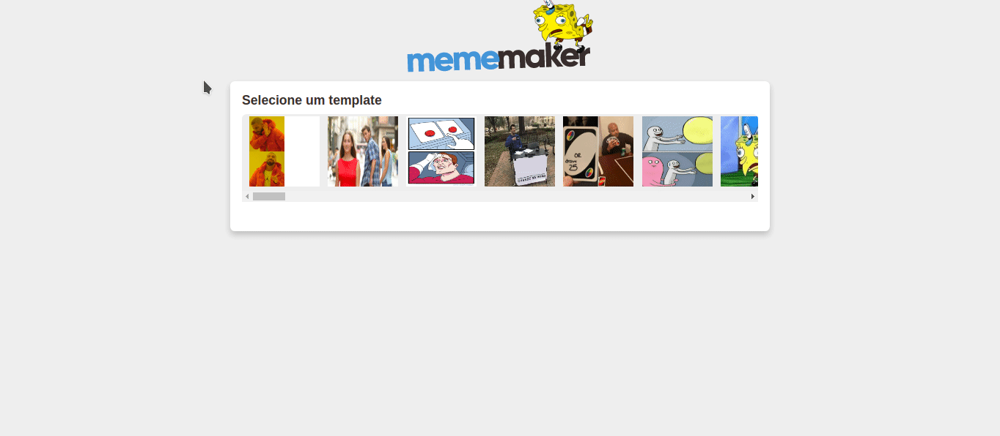

<h3 align="center">
    
    <br><br>
</h3>
  
<p align="center">
  <a href="#about">About</a>&nbsp;&nbsp;&nbsp;|&nbsp;&nbsp;&nbsp;
  <a href="#features">Features</a>&nbsp;&nbsp;&nbsp;|&nbsp;&nbsp;&nbsp;
  <a href="#technologies-used">Technologies Used</a>
</p>

<!-- Resultado -->
<h1 align="center">
    
</h1>


<a id="about"></a>
## About

<strong>MemeMaker</strong> is a web application made with React, consuming an [API](https://www.youtube.com/redirect?event=video_description&v=Yajip86C8sg&redir_token=TUUDr0iZ3Fts2USeNYEGmgPL1_R8MTU5MzExODE2MEAxNTkzMDMxNzYw&q=https%3A%2F%2Fapi.imgflip.com), to create a Memes generator. The construction was based on one of the developer and youtuber classes [Mateus Silva](https://www.youtube.com/channel/UCNckxUYl117w3hfgoj3DbWg), with some changes in the frontend made by me, like accessibility and responsivity.


<a id="features"></a>
## Features

- Memes creation, from an image gallery.

<a id="technologies-used"></a>
## Technologies Used

The project was developed using the following technologies:

- [React.js](https://pt-br.reactjs.org/)
- [Styled Components](https://styled-components.com/)


<a id="how-to-use"></a>
## How to Use

- ### **Pre-requisites**

  - It is **necessary** to have the **[Node.js](https://nodejs.org/en/)** installed on the machine
  - Also, it is **precise** to have a package manager either **[NPM](https://www.npmjs.com/)** or **[Yarn](https://yarnpkg.com/)**.

1. Make a clone:

```sh
  $ git clone https://github.com/ReinanS/memeMaker.git
```

2. Running the Application:

```sh
  # Install as dependencies
  $ npm install

  # Launch the application
  $ npm start
```

<a id="how-to-contribute"></a>
## How to Contribute

- Fork this repository,
- Create a branch with your resource: `git checkout -b my-feature`
- Commit your changes: `git commit -m 'feat: My new feature' `
- Push your branch: `git push origin my-feature`


## Who ministered?

The classes were taught by the instructor [Mateus Silva](https://www.youtube.com/channel/UCNckxUYl117w3hfgoj3DbWg).


## License

This project is under MIT license. See the [LICENSE](LICENSE.md) file for more details.

---

<h4 align="center">
    Made by <a href="https://www.linkedin.com/in/reinandesouza/" target="_blank">Reinan de Souza</a>
</h4>
